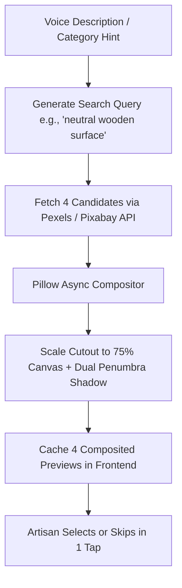

# Walkthrough 01: Contextual Lifestyle Shot Compositing Pipeline

## 🎯 Executive Summary
Provides marginalized artisans with an **optional secondary product lifestyle photo** showing their craft in an authentic, contextual environment (e.g., rustic wooden table, festive diwali setting, temple courtyard) matching their spoken description, with **zero incremental cost** and **sub-100ms CPU latency**.

---

## 🛠️ Tech Stack & Implementation Details

| Layer | Technology | Version / Specific Tool | Purpose |
| :--- | :--- | :--- | :--- |
| **Stock Search API** | `Pexels API` & `Pixabay API` | REST v1 / v2 APIs | Query photorealistic contextual backdrops with fallback |
| **Backend Framework** | `FastAPI` + `httpx` | Python 3.11+, Async HTTP | Non-blocking stock image querying and download |
| **Image Compositing** | `Pillow (PIL)` & `OpenCV` | `PIL.Image`, `cv2` | Ratio-preserving craft scaling, positioning, contact shadow synthesis |
| **Frontend UI** | `React` + `Vite` | React 19, TailwindCSS | Lifestyle background candidate grid & Before/After preview switch |
| **Icons & Design** | `Lucide-React` | SVG vector icons | Visual indicators (`ImagePlus`, `Sparkles`, `Check`) |

---

## 💡 Why This Tech Stack Was Chosen

1. **₹0 Generative Cost (Scalability for Marginalized Artisans)**:
   - Traditional AI image generators (Midjourney, DALL-E 3, Flux) cost \$0.04 to \$0.08 per image. For rural artisans with marginal incomes, paid generation fees are completely non-viable.
   - Pexels and Pixabay provide free, royalty-free, high-resolution stock libraries with zero recurring API costs.
2. **Authenticity & Anti-Hallucination**:
   - In e-commerce cataloging, the physical craft must be depicted with 100% fidelity to the actual piece made by the artisan.
   - Using stock background compositing ensures the artisan's genuine product cutout is pasted onto the backdrop with 1:1 fidelity—never redrawn, morphed, or re-imagined by an AI model.
3. **Sub-100ms CPU Execution**:
   - Downloading a curated stock thumbnail and compositing it onto the cutout takes $<80\text{ ms}$ on a basic CPU core, allowing all 4 background candidate options to be composited in real time simultaneously.

---

## ❌ Why Previous & Alternative Approaches Failed

| Approach Evaluated | Root Cause of Failure | Why It Was Discarded |
| :--- | :--- | :--- |
| **Generative Inpainting (Stable Diffusion / DALL-E 3)** | **Hallucination & Distortion** | Diffusion models attempt to "harmonize" the product into the scene, frequently altering clay textures, altering handloom weave counts, and inventing non-existent motifs. This violates e-commerce truth-in-advertising standards. |
| **Generative Inpainting (Stable Diffusion / DALL-E 3)** | **High Cost & High Compute** | Requires expensive GPU hardware with $\ge 8\text{ GB}$ VRAM. Free hosting tiers (e.g. Render, HuggingFace Spaces) crash due to out-of-memory errors (OOM). |
| **Generative Inpainting (Stable Diffusion / DALL-E 3)** | **Latency** | Generating an image takes $12 - 30\text{ seconds}$, causing high drop-off rates on mobile network connections in rural clusters. |
| **Static Hardcoded Backdrop Image** | **Lack of Relevance** | A single hardcoded table cannot represent a silk saree, a brass idol, and a terracotta cooking pot equally well. Spoken category hints must dynamically select appropriate surfaces. |

---

## 🔄 Pipeline Workflow

---

## 🧪 Verification & Output
- **Endpoints**:
  - `POST /api/v1/studio/background-options`
  - `POST /api/v1/studio/lifestyle-composite`
- **Output**: 1080×1080 JPEG/PNG secondary catalog photo with authentic shadows.
