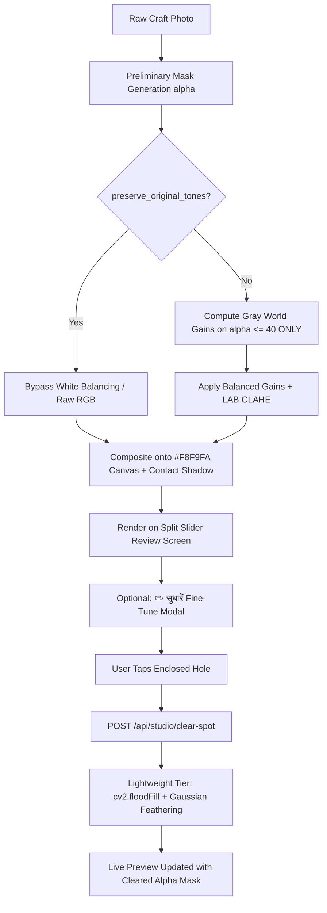

# Walkthrough 02: Segmentation-Aware White Balance, Tiered Hole Removal & Fine-Tune Modal

## 🎯 Executive Summary
Solves two critical image processing bugs in ShilpSetu's primary **AI Studio Image Enhancer**:
1. **Bug 1 (Color Distortion on Dominant Crafts)**: Fixed via **Segmentation-Aware 6500K White Balancing**, isolating background lighting from the craft's authentic hue.
2. **Bug 2 (Residual Background in Enclosed Loops)**: Fixed via **Tiered Single-Tap Hole Removal** using an ultra-lightweight OpenCV flood-fill with edge feathering, running in $<15\text{ ms}$ with zero additional model weights.
3. **Interactive Artisan Fine-Tune**: Provided an optional slide-up modal with tap-to-clear, AI vs Original color toggle, and audio-narrated sliders.

---

## 🛠️ Tech Stack & Implementation Details

| Layer | Technology | Version / Specific Tool | Purpose |
| :--- | :--- | :--- | :--- |
| **Color Cast Correction** | `OpenCV` + `NumPy` | `cv2.cvtColor`, boolean masks | Segmentation-aware Gray World gain computation strictly on ambient background (`alpha <= 40`) |
| **Luminance Normalization** | `OpenCV` CLAHE | `cv2.createCLAHE(clipLimit=2.0)` | Equalizes shadows/highlights in LAB color space without altering chrominance ($a^*, b^*$) |
| **Hole Clearing (Lightweight)** | `OpenCV` Flood-Fill | `cv2.floodFill` + morphological dilation | Millisecond single-tap residual background clearing with Gaussian boundary feathering |
| **Tiered Dispatcher** | `Python` / `FastAPI` | Configurable `PROCESSING_TIER` | Abstraction boundary (`clear_hole_at_point`) for future MobileSAM/SAM2 swap-in |
| **Real-time Filter Engine** | HTML5 Canvas 2D API | `CanvasRenderingContext2D.filter` | Instant slider preview + 1080×1080 JPEG filter baking on apply |
| **Zero-Text Audio System** | Web Speech API | `window.speechSynthesis` / `speakVoice` | Reads slider values and interactive instructions aloud in Hindi (`hi-IN`) |

---

## 💡 Why This Tech Stack Was Chosen

1. **Lightweight & Free-Tier Safe (Render Deployment Constraint)**:
   - Render's free tier provides 512MB RAM and zero GPU compute.
   - OpenCV's `cv2.floodFill` and morphological filters run entirely on CPU in $<15\text{ ms}$ with $0\text{ MB}$ additional model downloads. This guarantees zero server crashes, zero OOM terminations, and instant response times during live hackathon demonstrations.
2. **Segmentation-Aware Sampling Reference**:
   - Reordering the pipeline to run segmentation *first* enables the algorithm to use the workshop floor/wall as the neutral reference rather than assuming the whole image averages to gray.
   - The craft itself is masked out from the color-temperature adjustment matrix, preserving vibrant terracotta reds, mustard yellows, and indigo dyes.
3. **Accessibility-Centric Frontend**:
   - Rural artisans may have low literacy. Providing $\ge 48\text{ px}$ touch targets, visual tap ripple indicators, and bilingual voice narrations ensures any artisan can fine-tune their catalog without reading technical text.

---

## ❌ Why Previous & Alternative Approaches Failed

| Approach | Root Cause of Failure | Impact & Why It Was Discarded |
| :--- | :--- | :--- |
| **Standard Full-Frame Gray World Assumption (Previous Approach)** | **Full-Frame Averaging Distortion** | Standard Gray World averages all pixels in the frame to $(128, 128, 128)$. When a large terracotta pot or brass deity fills 80% of the camera view, its natural warm color is misidentified as ambient lighting cast. The algorithm aggressively subtracts red/yellow, bleaching vibrant terracotta into a washed-out, lifeless gray. |
| **rembg / BiRefNet on Enclosed Loops (Previous Approach)** | **Topological Boundary Confusion** | Global U-Net semantic segmentation models treat inner loops (e.g., inside jug handles, mug loops, or sunglasses arms) as part of the foreground object, leaving ugly, stuck patches of the artisan's cluttered workshop floor. |
| **MobileSAM / SAM 2 (Segment Anything) Point-Prompt Models** | **Heavy Compute & Memory Overhead** | Requires downloading $40\text{ MB} - 100\text{ MB}+$ model weights and loading PyTorch tensors into RAM. On Render's 512MB free tier, this causes instant out-of-memory (OOM) crashes, high cold-start latency, and instability. |
| **Multi-Brush / Freehand Canvas Erasing UI** | **High Motor Skill & Cognitive Friction** | Small mobile screens make precise finger dragging difficult for rural artisans. It frequently erodes thin product edges. Replacing it with a single tap-to-clear action eliminates dexterity requirements. |

---

## 🔄 Architectural Workflow

---

## 🧪 Verification & Output
- **Endpoints**:
  - `POST /api/v1/studio/clear-spot` (2,909 pixels cleared in test, status 200)
  - `POST /api/v1/studio/enhance` (supports `preserve_original_tones=True`, status 200)
- **Frontend Build**: Vite production build succeeded in 892ms with 0 errors.
